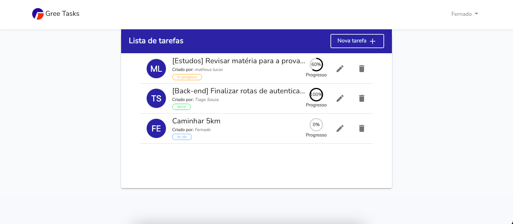

# Gree Tasks

Projeto para o processo seletivo da empresa Gree. o projeto implementa o CRUD de tarefas dos usuários.

## Começando

Para executar o projeto, será necessário ter instalado os seguintes programas:
- [PHP 7.4](https://www.php.net/downloads.php)
- [MYSQL 5.7](https://www.mysql.com/downloads/)
- [Gerenciador de pacotes Composer](https://getcomposer.org/download/)
- [npm e nodejs](https://nodejs.org/en/download/)

> Para realizar um clone do projeto e entrar na pasta do projeto usando o seguinte comando:

```bash
git clone https://github.com/m7hsouza/gree__tasks.git
cd gree__tasks
```

## Instalando dependências

- instalar as dependências do `nodejs` e `php`

```bash
  composer install
  npm install && npm run dev
```

## Variáveis de ambientes e Banco de dados

- criar um arquivo .env e copiar o conteúdo de .env-example e realizar as alterações necessárias

```bash
  copy .env-example .env
```

> Realizar o comando acima dentro da pasta do projeto
> dentro do arquivo `.env` altere o valor da variáveis `DB_DATABASE` com o nome da base de dados criado, `DB_USERNAME` usuário do banco de dados, `DB_PASSWORD` senha do banco de dados *(obs: caso não tenha senha deixar em branco)*

- com `database` criada e as variáveis de ambiente configura, bastar executar as migrations.

```bash
  php artisan migrate
  php artisan db:seed
```

## Executando projeto

- com todas as configurações realizada, basta iniciar o projeto.
```bash
  php artisan serve
```

### Pagina inicial

